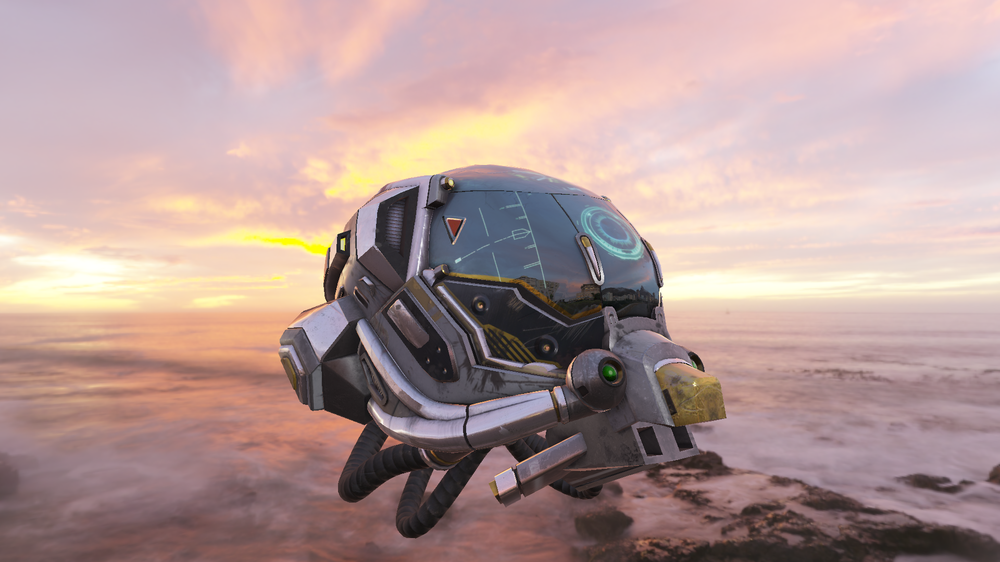
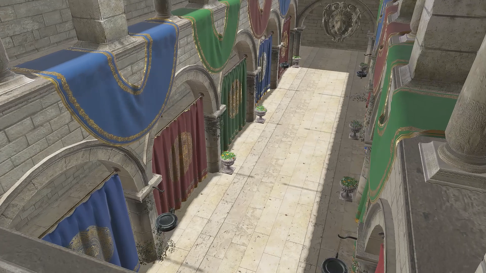
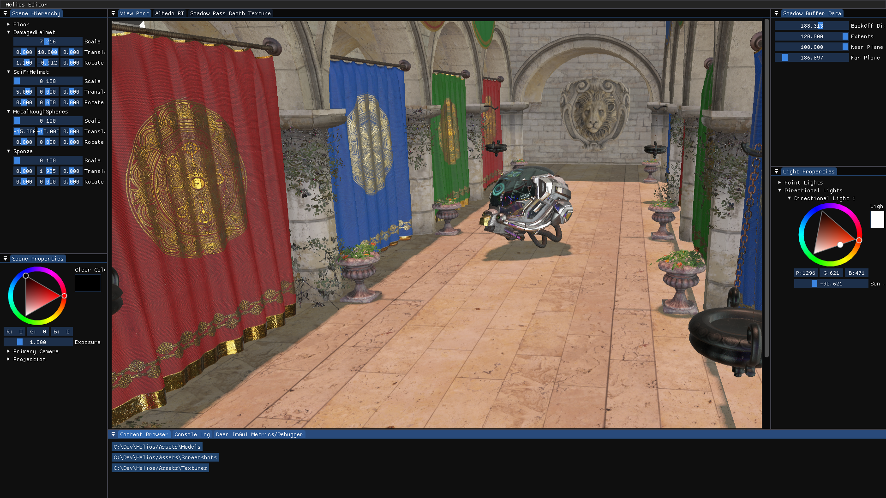

# Helios

A Experimental, C++20 & DX12 renderer made for learning and trying out various graphics / rendering techniques.

# Features
* Bindless Rendering (Using SM 6.6's Resource / Sampler descriptor Heap).
* Normal Mapping.
* Diffuse and Specular IBL.
* Physically based rendering (PBR).
* Blinn-Phong Shading.
* Deferred Shading.
* HDR and Tone Mapping.
* Instanced rendering.
* OmniDirectional Shadow Mapping.
* Editor (ImGui Integration) with Logging and Content Browser.
* Compute Shader mip map generation.
* Multi-threaded asset loading.

# Gallery
> PBR and IBL

> Omni-directional Shadow Mapping (With PCF)

> Editor (using ImGui)

> Deferred Shading

# Building
+ This project uses CMake as a build system, and all third party libs are setup using CMake's FetchContent().
+ After cloning the project, build the project using CMake (cmake --build Build --config Release) (or alternatively open the folder if your IDE supports doing so). The application will take care of relative file paths.
+ Run the setup.bat file, which will install the DirectXAgility SDK. 
+ Ensure you have installed the DirectXShaderCompiler (must support atleast SM 6.6).
+ Shaders are automatically compiled after build process, however to compile manually, run the CompileShaders.bat (or alternatively the CompileShaders.py script) from the Shaders directory.

