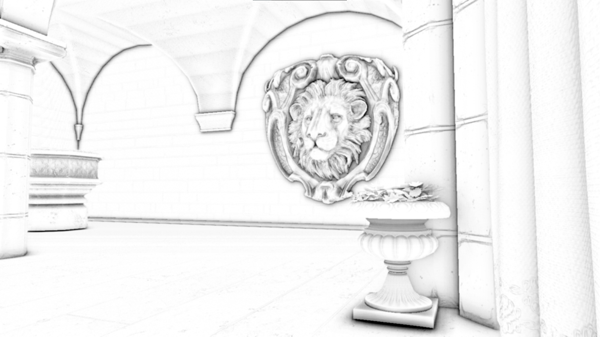
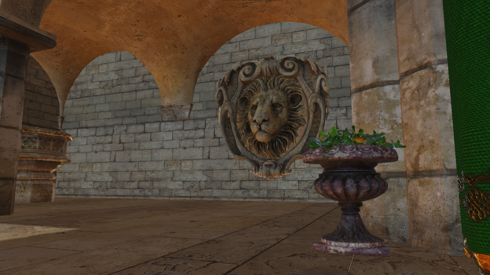
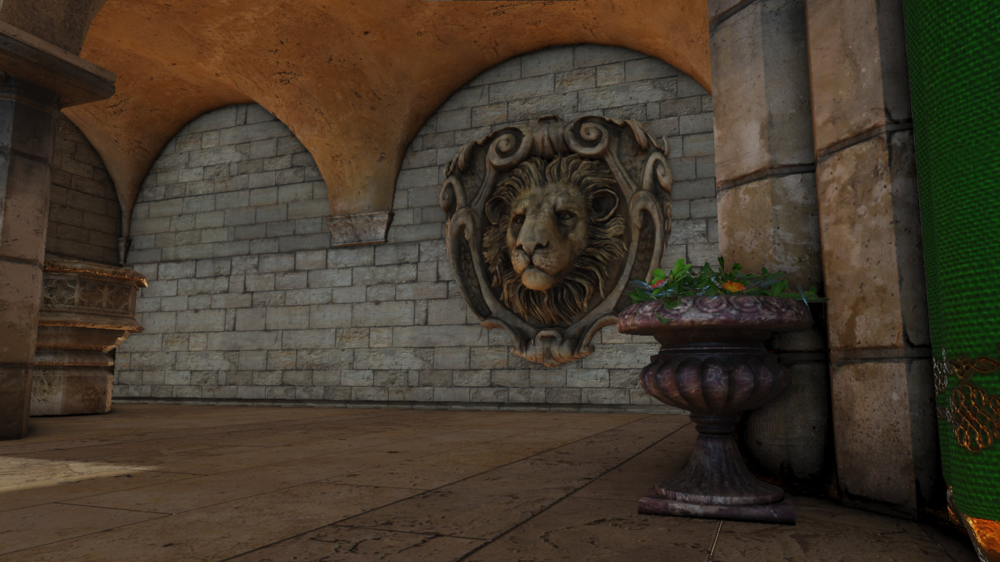

# Helios

An experimental C++20 & DX12 renderer made for learning and trying out various graphics / rendering techniques.

# Features
* Bindless Rendering (Using SM 6.6's Resource / Sampler descriptor Heap).
* Normal Mapping.
* Physically based rendering (PBR).
* Diffuse and Specular IBL.
* Bloom (Based on the Call of Duty Next Generation Post Processing presentation).
* Screen Space Ambient Occlusion (SSAO).
* Blinn-Phong Shading.
* Deferred Shading.
* HDR and Tone Mapping.
* OmniDirectional Shadow Mapping.
* Instanced rendering.
* Compute Shader mip map generation.
* Multi-threaded asset loading.
* Editor (ImGui Integration) with Logging and Content Browser with drag-drop functionality for GLTF models.
* D3D12MA integration.
* Shader Compilation using DirectX Shader Compiler (DXC).

# Gallery
> PBR and IBL


> Omni-directional Shadow Mapping (With PCF)


> SSAO (Screen Space Ambient Occlusion)
* Blurred SSAO texture


* SSAO Disabled (Top) with SSAO Enabled (Bottom)
 


> Bloom (Inspired from the Call of Duty Presentation on Next Generation Post Processing)


> Editor (using ImGui)


> Deferred Shading


# Showcase Video
[Link : Click here, or on the Image below!](https://youtu.be/hKeVVCpzVhQ) \
[](https://youtu.be/hKeVVCpzVhQ)

# Third Party Libraries
* [Dear ImGUI](https://github.com/ocornut/imgui)
* [D3D12 Memory Allocator](https://github.com/GPUOpen-LibrariesAndSDKs/D3D12MemoryAllocator)
* [STB Image](https://github.com/nothings/stb)
* [Tiny GLTF](https://github.com/syoyo/tinygltf)

# Building
+ This project uses CMake as a build system, and all third party libs are setup using CMake's FetchContent().
+ After cloning the project, build the project using CMake :
``` 
cmake -S . -B Build
cmake --build Build --config Release
```

Alternatively open the folder in Visual Studio's open folder mode.
+ Run the `Setup.bat` file, which will install the DirectXAgility SDK and the DirectXShader Compiler. You will be asked to enter the build path, which was the same path you gave in cmake -S . -B 'BuildPath'. 


# Reference Projects :
[Wicked Engine](https://github.com/turanszkij/WickedEngine) By Turánszki János. \
[Vanguard Engine](https://github.com/adepke/VanguardEngine/tree/master) By Andrew Depke. \
[Adria-DX12](https://github.com/mateeeeeee/Adria-DX12) By Mate Buljan. \
[DirectX Graphics Samples](https://github.com/Microsoft/DirectX-Graphics-Samples) from Microsoft.